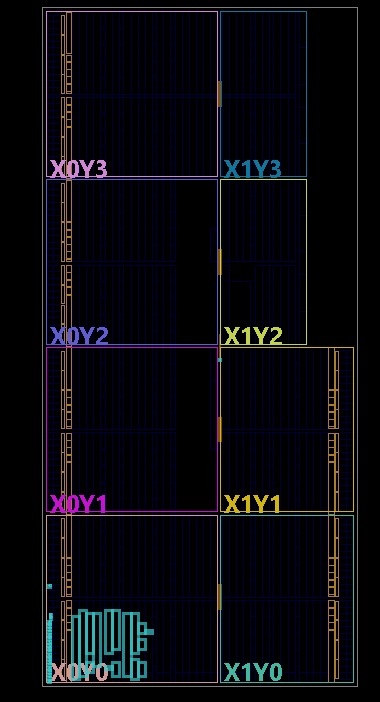
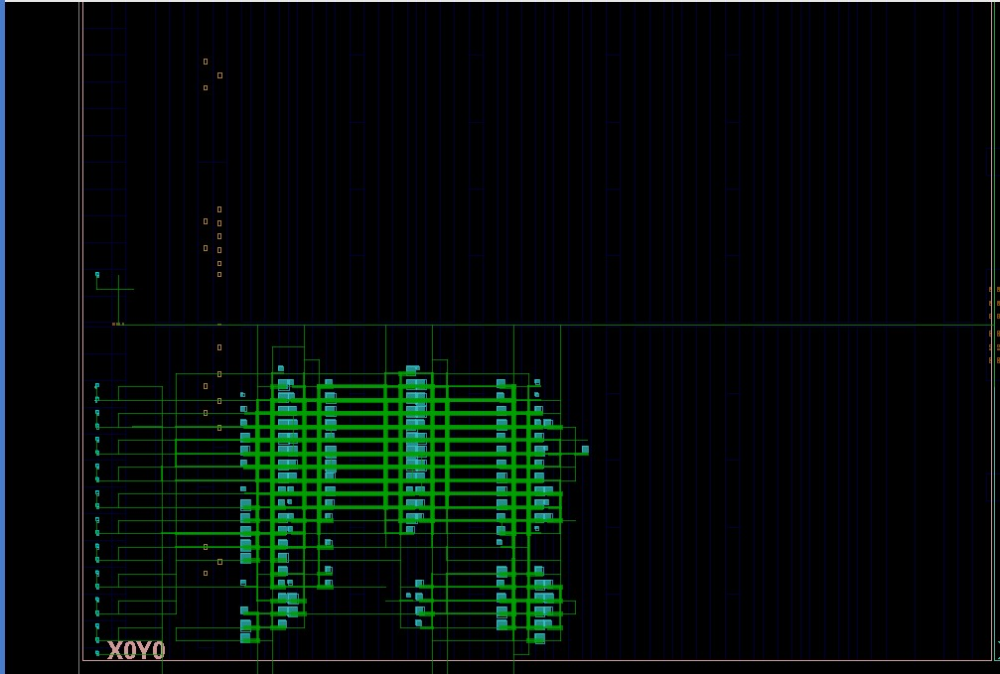

# 5-Stage Pipelined 8-Bit CPU Core Architecture

**Team elec_03 | IIT Indore**

A high-performance, 16-bit instruction, 8-bit data pipelined microprocessor core implemented in synthesizable Verilog. This core features a classic 5-stage pipeline (**Fetch, Decode, Execute, Memory, Write-Back**) enhanced with dynamic hardware branch prediction, comprehensive data forwarding, coprocessor-based exception processing, hardware interrupt vectoring, and memory-mapped peripherals (UART, PWM, GPIO, ADC).

---

## 📐 Microarchitecture Overview

```text
       +---------+     +---------+     +---------+     +---------+     +---------+
       |   IF    | --> |   ID    | --> |   EX    | --> |   MEM   | --> |   WB    |
       |  Fetch  |     | Decode  |     | Execute |     | Memory  |     |Write-Back|
       +---------+     +---------+     +---------+     +---------+     +---------+
            |               |               |               |               |
        [u_PC / IMEM]   [u_RegFile]     [u_ALU / BRU]   [u_DMEM / UART]  [Write Mux]
        [u_BP (BTB)]   [Load-Use Hazard] [u_FWD / CP0]   [u_PWM]
```

  
</a>

### Key Architectural Specifications:
- **Instruction Width:** 16 bits
- **Data Bus Width:** 8 bits
- **Address Space:** 8-bit byte-addressed memory (256 bytes total)
- **Register File:** 8 x 8-bit registers (`R0`–`R7`) with `R0` hardwired to `0`. `R6` serves as SP / Scratch, `R7` serves as Link Register (`JAL`).
- **Pipeline Hazards:** Fully resolved via **EX->EX** and **MEM->EX** data forwarding, automatic **Load-Use hazard stalling**, and **Branch mispredict pipeline flushes**.
- **Branch Predictor:** 32-entry Branch Target Buffer (BTB) & 32-entry Branch History Table (BHT).
- **CP0 Coprocessor:** Hardware exception unit handling Overflow, Illegal Instruction, Software Trap, and External Interrupt vectoring to `0x80`.
- **Peripherals:** 115200 Baud UART (TX/RX), 8-bit PWM Motor Generator, 8-bit Digital GPIO Inputs, 8-bit ADC Inputs.

---

## 📜 Instruction Set Architecture (ISA) & Encoding

Instructions are 16-bit words categorized into 5 primary formats based on Opcode (`inst[15:11]`):

```text
1. R-Type (Register):  | Opcode (5) | Rd (3) | Rs1 (3) | Rs2 (3) | Unused (2) |
2. I-Type (Immediate): | Opcode (5) | Rd (3) | Immediate (8)                 |
3. ADDI-Type (Offset): | Opcode (5) | Rd (3) | Rs1 (3) | Imm5 (5)            |
4. Branch / Direct:    | Opcode (5) | Rs1 (3)| Immediate / Target Address (8)  |
5. System / Indirect:  | Opcode (5) | Rs1 (3)| Unused (8)                    |
```

### Master Instruction Table (28 Instructions)

| Opcode (Bin) | Opcode (Hex) | Mnemonic | Format | Assembly Syntax | Operation Description |
| :---: | :---: | :--- | :--- | :--- | :--- |
| `00000` | `0x00` | **ADD** | R-Type | `ADD Rd, Rs1, Rs2` | `Rd = Rs1 + Rs2` |
| `00001` | `0x01` | **SUB** | R-Type | `SUB Rd, Rs1, Rs2` | `Rd = Rs1 - Rs2` |
| `00010` | `0x02` | **AND** | R-Type | `AND Rd, Rs1, Rs2` | `Rd = Rs1 & Rs2` |
| `00011` | `0x03` | **OR** | R-Type | `OR Rd, Rs1, Rs2` | `Rd = Rs1 \| Rs2` |
| `00100` | `0x04` | **XOR** | R-Type | `XOR Rd, Rs1, Rs2` | `Rd = Rs1 ^ Rs2` |
| `00101` | `0x05` | **SHL** | R-Type | `SHL Rd, Rs1, Rs2` | `Rd = Rs1 << Rs2[2:0]` |
| `00110` | `0x06` | **SHR** | R-Type | `SHR Rd, Rs1, Rs2` | `Rd = Rs1 >> Rs2[2:0]` |
| `00111` | `0x07` | **LDI** | I-Type | `LDI Rd, imm8` | `Rd = imm8` |
| `01000` | `0x08` | **LDD** | ADDI-Type | `LDD Rd, Rs1, imm5` | `Rd = Memory[Rs1 + ZeroExt(imm5)]` |
| `01001` | `0x09` | **STR** | R-Type | `STR Rs1, Rs2, imm5` | `Memory[Rs2 + ZeroExt(imm5)] = Rs1` |
| `01010` | `0x0A` | **JMP** | Branch | `JMP imm8` | `PC = PC + SignExt(imm8)` |
| `01011` | `0x0B` | **JZ** | Branch | `JZ Rs1, imm8` | `if (Rs1 == 0) PC = PC + SignExt(imm8)` |
| `01100` | `0x0C` | **JNZ** | Branch | `JNZ Rs1, imm8` | `if (Rs1 != 0) PC = PC + SignExt(imm8)` |
| `01101` | `0x0D` | **JGT** | Branch | `JGT Rs1, imm8` | `if ($signed(Rs1) > 0) PC = PC + SignExt(imm8)` |
| `01110` | `0x0E` | **ADDI**| ADDI-Type | `ADDI Rd, Rs1, imm5` | `Rd = Rs1 + SignExt(imm5)` |
| `01111` | `0x0F` | **SLT** | R-Type | `SLT Rd, Rs1, Rs2` | `Rd = ($signed(Rs1) < $signed(Rs2)) ? 1 : 0` |
| `10000` | `0x10` | **MUL** | R-Type | `MUL Rd, Rs1, Rs2` | `Rd = (Rs1 * Rs2)[7:0]` |
| `10001` | `0x11` | **MAC** | R-Type | `MAC Rd, Rs1, Rs2` | `Rd = Rd + (Rs1 * Rs2)[7:0]` |
| `10010` | `0x12` | **ROL** | R-Type | `ROL Rd, Rs1, Rs2` | `Rd = RotateLeft(Rs1, Rs2[2:0])` |
| `10011` | `0x13` | **ROR** | R-Type | `ROR Rd, Rs1, Rs2` | `Rd = RotateRight(Rs1, Rs2[2:0])` |
| `10100` | `0x14` | **RETI**| System | `RETI` | Return from Interrupt (`PC = epc`) |
| `10101` | `0x15` | **STD** | Branch | `STD Rs1, imm8` | `Memory[imm8] = Rs1` |
| `10110` | `0x16` | **JAL** | Branch | `JAL R7, imm8` | `R7 = PC + 1; PC = PC + SignExt(imm8)` |
| `10111` | `0x17` | **JR**  | System | `JR Rs1` | `PC = Rs1` (Indirect Jump) |
| `11000` | `0x18` | **TRAP**| System | `TRAP` | Software Trap (`PC = 0x80`, `cause = 3`) |
| `11001` | `0x19` | **ERET**| System | `ERET` | Return from Exception (`PC = exception_epc + 1`) |
| `11010` | `0x1A` | **MFC0**| I-Type | `MFC0 Rd, sel` | `Rd = (sel[0] ? exception_epc : exception_cause)` |
| `11111` | `0x1F` | **HALT**| System | `HALT` | Freeze CPU Execution (`halt = 1`) |

For complete detailed opcode specifications, refer to [docs/isa_specification.md](file:///c:/Users/JEETJJJEE/OneDrive/Desktop/verilog/final/presentation/docs/isa_specification.md).

---

## 🗺️ Memory & Memory-Mapped I/O (MMIO) Map

The CPU features an 8-bit memory space (`0x00`–`0xFF`). Top addresses `0xFA` through `0xFF` are mapped to hardware peripherals:

| Address | Peripheral / Function | Access Type | Hardware Pin / Wire |
| :---: | :--- | :---: | :--- |
| `0x00` – `0xF9` | Data RAM (250 Bytes) | Read / Write | Internal SRAM |
| `0xFA` | **UART Status** (`[7]=overrun, [1]=tx_ready, [0]=rx_valid`) | Read-Only | Hardware Status Signals |
| `0xFB` | **UART Receiver Data Register** | Read-Only | `uart_rx` Serial Pin |
| `0xFC` | **UART Transmitter Data Register** | Write-Only | `uart_tx` Serial Pin |
| `0xFD` | **External ADC Inputs** | Read-Only | `external_adc_pins` (8-bit) |
| `0xFE` | **External Digital Inputs** | Read-Only | `external_digital_pins` (8-bit) |
| `0xFF` | **PWM Motor Duty Cycle** | Read / Write | `motor_pwm_pin` Output |

---

## ⚙️ Hardware Features & Pipeline Resolution

1. **Forwarding Unit (`u_FWD`):**
   - **EX->EX Forwarding:** Forwards computed ALU results directly to `RS1`, `RS2`, and `RS3` (`MAC`) of the next instruction in EX stage.
   - **MEM->EX Forwarding:** Forwards Write-Back data to EX stage operands without stalling.
2. **Hazard Stalling:**
   - Detects **Load-Use hazards** (when an instruction in Decode stage depends on `LDD` currently in Execute stage) and automatically stalls IF/ID and PC while injecting a bubble into ID/EX.
3. **Branch Prediction & Flushes (`u_BP` & `u_BRU`):**
   - Predicts branch targets combinationally at Fetch. Resolves actual outcome in Execute stage.
   - On misprediction (`ex_mispredict`), flushes `IF_ID` and `ID_EX` registers and redirects PC to the correct recovery address.
4. **Coprocessor 0 Exception Processing (`u_CP0`):**
   - Vectors to Exception Address `0x80`.
   - Saves fault PC into `exception_epc` and cause into `exception_cause` (`1` = Overflow, `2` = Illegal, `3` = Trap).
   - Instructions `MFC0` read CP0 registers; `ERET` exits exception context cleanly.

---
## 🔬 Synthesis & Physical Implementation Results

### Physical Layout & Floorplan Diagram
<a href="docs/layout.jpeg" target="_blank">
  
</a>

<a href="docs/layout_zoom.jpeg" target="_blank">
  
</a>

### Timing & Frequency Performance
| Parameter | Value | Unit | Notes / Details |
| :--- | :---: | :---: | :--- |
| **Max Operating Frequency ($F_{max}$)** | _135.8_ | MHz | Target Synthesis Constraint |
| **Minimum Clock Period ($T_{clk}$)** | _7.363_ | ns | $T_{clk} = 1 / F_{max}$ |
| **Critical Path Latency** | _36.815_ | ns | ALU / Forwarding Mux -> Register File |
| **Pipeline Latency** | 5 | Cycles | IF -> ID -> EX -> MEM -> WB |
| **Target Technology / Family** | _[K intex-7 die ]_ | - | Synthesis Target |

### Resource Utilization & Gate Count
| Resource Type | Utilization / Count | Available | Percentage (%) |
| :--- | :---: | :---: | :---: |
| **LUTs (Look-Up Tables)** | _[808]_ | _[-]_ | _[1.97%]_ |
| **Flip-Flops (Registers)**| _[361]_ | _[-]_ | _[0.44%]_ |
| **Distributed RAM ** | _[84 LUTS]_ | _[-]_ | _[-]_ |
| **DSP48 slices ** | _[0]_ | _[-]_ | _[-]_ |

### Power Analysis Summary
| Power Category | Value | Unit |
| :--- | :---: | :---: |
| **Dynamic Power** | _[19]_ | mW |
| **Static / Leakage Power** | _[81]_ | mW |
| **Total Power Consumption** | _[100]_ | mW |


</a>
