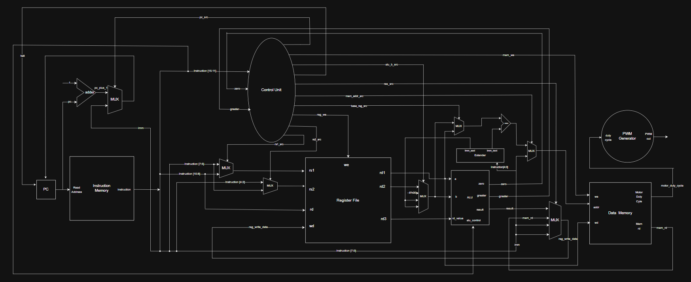

# 5-Stage Pipelined 8-Bit RISC SoC

> A fully synthesizable System-on-Chip built in Verilog — custom pipelined CPU, I²C sensor interface, hardware DSP, and real-time fluid physics on an 8×8 LED matrix.

**Team Voltere** · IIT Indore · [IITISoC 2026](https://github.com/IITISoC)

[](#)
[](#)
[](#)
[](#-verification)


## Overview

This project implements a **custom 8-bit RISC microprocessor** with a 5-stage pipeline, deployed on a **Xilinx Arty A7 FPGA** at 25 MHz. The CPU communicates with an MPU-6050 IMU over I²C and drives an 8×8 LED matrix displaying a viscous water droplet that responds to board tilt in real time.

### Key Specifications

| Parameter | Value |
|:--|:--|
| Pipeline | 5-stage (IF → ID → EX → MEM → WB) |
| Instruction Width | 16-bit, 28 instructions ([ISA Spec](docs/ISA_specification.md)) |
| Data Width | 8-bit |
| Clock | 25 MHz (from 100 MHz via PLL) |
| Branch Prediction | 32-entry BTB + BHT |
| Hazard Handling | Full data forwarding (EX→EX, MEM→EX) + Load-Use stalling |
| Exception Handling | CP0 coprocessor (EPC, CAUSE, ERET, TRAP) |
| Peripherals | I²C master (100 kHz), UART (115200 baud), PWM, GPIO |
| Target FPGA | Xilinx Artix-7 XC7A35T (Arty A7-35T) |

---

## Architecture

<p align="center">
  
</p>

### Hardware/Software Co-Design

The SoC splits functionality between **CPU firmware** (software) and **dedicated hardware accelerators**:

```
                    ┌─────────────────────────────────┐
                    │      SOFTWARE (CPU Firmware)     │
                    │                                  │
                    │  Boot: Initialize MPU-6050 I²C   │
                    │  Loop: Poll accel_x, accel_y     │
                    │        Write to MMIO 0xF3, 0xF4  │
                    └───────────────┬─────────────────-┘
                                    │  Memory-Mapped I/O
                                    ▼
                    ┌──────────────────────────────────┐
                    │      HARDWARE (FPGA Fabric)      │
                    │                                  │
                    │  I²C Engine → 100 kHz bus        │
                    │  DSP Filter → 2-stage EMA        │
                    │  Physics Engine → fluid sim      │
                    │  LED Driver → 1 kHz mux, 125 Hz  │
                    └──────────────────────────────────┘
```

---

## Pipeline Features

### Data Forwarding
- **EX→EX forwarding:** ALU results bypass directly to the next instruction's operands — zero-stall.
- **MEM→EX forwarding:** Write-back data forwarded to EX stage without stalling.

### Load-Use Hazard Detection
When an instruction in Decode depends on a `LDD` in Execute, the pipeline automatically stalls IF/ID for one cycle and inserts a bubble.

### Dynamic Branch Prediction
- 32-entry **Branch Target Buffer (BTB)** predicts branch targets at Fetch.
- 32-entry **Branch History Table (BHT)** tracks taken/not-taken patterns.
- On misprediction: flush IF/ID and ID/EX, redirect PC to correct target.

### CP0 Exception Handling
- Exception vector at `0x80`
- Causes: Overflow (`1`), Illegal Instruction (`2`), Software Trap (`3`)
- `MFC0` reads CP0 registers; `ERET` returns from exception context.

---

## LED Matrix — Fluid Physics Engine

The [`led_matrix_controller.v`](src/led_matrix_controller.v) renders a **3×3 viscous water droplet** on a 1588BS 8×8 LED matrix. The droplet physically flows in response to board tilt.

### Signal Processing Pipeline

```
  Raw IMU byte (signed 8-bit, ±2g range)
         │
         ▼
  ┌─ Auto-Calibration ──────────────────────┐
  │  64-sample average on reset (1.2s)      │
  │  Eliminates zero-g bias                 │
  └──────────────────────────────────────────┘
         │  corrected = raw − bias
         ▼
  ┌─ 2-Stage EMA DSP Filter ────────────────┐
  │  Stage 1: α = 1/64  (noise rejection)   │
  │  Stage 2: α = 1/32  (smooth roll-off)   │
  └──────────────────────────────────────────┘
         │
         ▼
  ┌─ Q8.8 Fluid Kinematics (50 Hz) ────────┐
  │  vel += gravity                          │
  │  vel *= 0.844 (viscous drag)             │
  │  pos += vel                              │
  └──────────────────────────────────────────┘
         │
         ▼
  ┌─ Shape Renderer ────────────────────────┐
  │  3×3 core + fluid tail + wall splash    │
  │  1 kHz column mux → 125 Hz refresh      │
  └──────────────────────────────────────────┘
```

### Fluid Behavior

| Condition | Response |
|:--|:--|
| Flat (post-calibration) | Drop locked dead-center, zero jitter |
| Gentle tilt | Smooth viscous acceleration |
| Steep tilt | Drop rushes across matrix with trailing elongation |
| Wall impact | Flattens into a 5–7 pixel splash, then pulls back |
| Return to flat | Viscous drag decelerates and re-centers smoothly |

> ⚠️ **Calibration:** Keep the board flat for the first 1.2 seconds after RESET. The hardware samples 64 IMU readings to learn the resting bias.

---

## Verification

All testbenches are self-checking and located in [`sim/comprehensive_test/`](sim/comprehensive_test/).

| Testbench | Coverage | Status |
|:--|:--|:--:|
| `tb_isa_instructions.v` | All 28 ISA instructions | ✅ |
| `tb_hazards_forwarding.v` | EX→EX, MEM→EX forwarding, Load-Use stalls | ✅ |
| `tb_branch_prediction.v` | BTB/BHT hits/misses, JAL/JR, mispredict flushes | ✅ |
| `tb_exceptions_interrupts.v` | Overflow, Illegal, TRAP, MFC0, ERET, RETI | ✅ |
| `tb_peripherals_uart.v` | GPIO, ADC, PWM, UART TX | ✅ |
| `tb_uart_full_loopback.v` | UART TX→RX loopback at 115,200 baud | ✅ |
| `tb_master_suite.v` | Integrated system-level verification | ✅ |
| `tb_cpu_i2c.v` | Full CPU + I²C + MPU-6050 mock slave | ✅ |

### Run Tests (Icarus Verilog)

```bash
# Full system verification
iverilog -I src -o sim_test src/*.v sim/comprehensive_test/tb_master_suite.v && vvp sim_test

# CPU + I2C co-simulation
iverilog -o sim_test design.v src/i2c_peripheral.v src/led_matrix_controller.v sim/tb_cpu_i2c.v && vvp sim_test
```

---

## Memory Map

| Address | Register | Access | Description |
|:--:|:--|:--:|:--|
| `0x00–0xDF` | Data RAM | R/W | 224 bytes general-purpose SRAM |
| `0xF0` | UART TX Data | W | Byte to transmit |
| `0xF1` | UART Status | R | Bit 0: TX Busy, Bit 1: RX Valid |
| `0xF2` | UART RX Data | R | Received byte |
| `0xF3` | Accel Y-Axis | R/W | MPU-6050 `ACCEL_YOUT_H` |
| `0xF4` | Accel X-Axis | R/W | MPU-6050 `ACCEL_XOUT_H` |
| `0xF5` | I²C Command | W | `0x01` = Read, `0x02` = Write |
| `0xF6` | I²C Status | R | Bit 0: BUSY, Bit 1: NACK |
| `0xF7` | I²C Slave Addr | W | `0x68` for MPU-6050 |
| `0xF8` | I²C Reg Addr | W | Target sensor register |
| `0xF9` | I²C Write Data | W | Byte to write to sensor |
| `0xFA` | I²C Read Data | R | Byte received from sensor |
| `0xFC` | GPIO LED | W | LED output control |
| `0xFD` | GPIO Switches | R | Onboard switch states |

---

## Repository Structure

```
├── design.v                        # Top-level SoC (CPU + MMIO + peripherals)
├── arty_a7.xdc                     # FPGA pin constraints
├── program.hex.txt                 # CPU firmware (hand-assembled machine code)
│
├── src/                            # Synthesizable Verilog modules
│   ├── cpu_core.v                  # 5-stage pipelined CPU core
│   ├── alu.v                       # ALU (28 ops, MUL, MAC, shifts, rotates)
│   ├── branch_pred.v               # 32-entry dynamic BTB + BHT
│   ├── branch_resolution_unit.v    # Branch outcome & mispredict recovery
│   ├── fwd_unit.v                  # EX→EX & MEM→EX data forwarding
│   ├── exception_unit.v            # CP0 coprocessor
│   ├── control_unit.v              # Instruction decode & pipeline control
│   ├── reg_file.v                  # 8×8-bit dual-read register file
│   ├── data_memory.v               # RAM + MMIO peripheral decoder
│   ├── instr_memory.v              # Instruction ROM
│   ├── i2c_peripheral.v            # Hardware I²C master (100 kHz)
│   ├── led_matrix_controller.v     # Fluid physics + DSP + LED driver
│   ├── uart_transmitter.v          # UART TX serializer
│   ├── uart_receiver.v             # UART RX deserializer
│   ├── uart_peripheral.v           # UART MMIO controller
│   ├── pwm_generator.v             # 8-bit hardware PWM
│   ├── oled_controller.v           # SPI/I2C OLED display controller
│   ├── int_control.v               # Hardware interrupt controller
│   ├── reset_synchronizer.v        # Power-on reset synchronizer
│   ├── extender.v                  # Sign/zero immediate extender
│   ├── pc.v                        # Program counter register
│   └── defines.v                   # ISA opcode & control definitions
│
├── sim/                            # Verification & simulation
│   ├── comprehensive_test/         # Self-checking verification suites
│   │   ├── tb_master_suite.v       #   Integrated system-level test
│   │   ├── tb_isa_instructions.v   #   All 28 ISA instructions
│   │   ├── tb_hazards_forwarding.v #   Data hazards & forwarding
│   │   ├── tb_branch_prediction.v  #   Branch prediction & flush
│   │   ├── tb_exceptions_interrupts.v # CP0 exceptions & interrupts
│   │   ├── tb_peripherals_uart.v   #   GPIO, ADC, PWM, UART TX
│   │   └── tb_uart_full_loopback.v #   UART TX→RX loopback
│   ├── tb_cpu_i2c.v                # CPU + I²C + MPU-6050 co-simulation
│   ├── tb_i2c.v                    # Standalone I²C engine test
│   ├── clk_wiz_0_stub.v            # Clock wizard simulation stub
│   ├── bonus1/                     # Recursive factorial benchmark
│   ├── bonus2/                     # Exception handling verification
│   ├── bonus2_individual/          # Isolated unit exception tests
│   ├── end_eval/                   # Core evaluation benchmark
│   ├── fact/                       # Factorial test
│   └── uart/                       # UART TX verification
│
├── docs/                           # Documentation
│   ├── ISA_specification.md        # Full instruction encoding manual
│   ├── Architecture_Diagram.png    # CPU architecture block diagram
│   ├── arch.svg                    # Architecture diagram (SVG)
│   └── microarchitecture.svg       # Detailed microarchitecture diagram
```

---

## Building & Programming

1. Create a Vivado project targeting `xc7a35tcsg324-1`
2. Add `design.v`, all `src/*.v` files, `program.hex.txt`, and `arty_a7.xdc`
3. Add IP: **Clocking Wizard** (`clk_wiz_0`) — 100 MHz input → 25 MHz output
4. Run Synthesis → Implementation → Generate Bitstream
5. Program the FPGA via Hardware Manager
6. Press **RESET** and keep the board flat for 1.2 seconds (calibration)

---

## Hardware

| Component | Model | Notes |
|:--|:--|:--|
| FPGA | Digilent Arty A7-35T | Artix-7 XC7A35TCSG324-1 |
| IMU | MPU-6050 | I²C @ 3.3V, address `0x68` |
| LED Matrix | 1588BS 8×8 | Common-cathode, via PMOD JC/JD |

---

## License

This project was developed as part of [IITISoC 2026](https://github.com/IITISoC) at IIT Indore.
